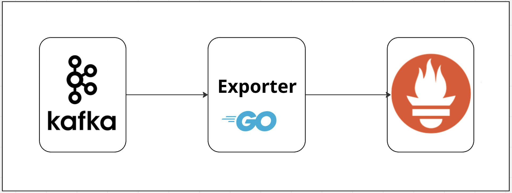
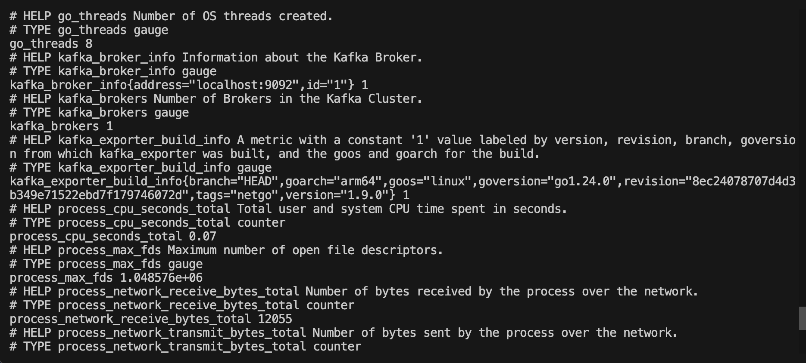
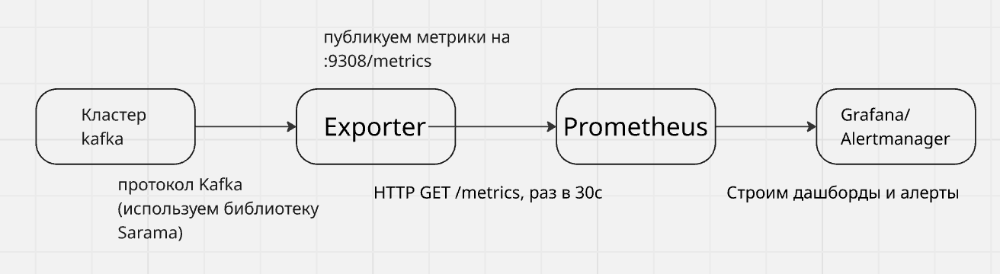

# Содержание

1. [Список статей в данном цикле](#in-0)
2. [Введение](#in-1)
3. [Теория Prometheus и exporter](#in-2)
	1. [Что такое Prometheus](#in-2-1)
	2. [Что такое exporter и когда он нужен](#in-2-2)
	3. [Формат метрик](#in-2-3)
	4. [Типы метрик](#in-2-4)
	5. [Лейблы](#in-2-5)
	6. [Naming convention](#in-2-6)
	7. [Exporter в общей картине](#in-2-7)
	8. [Выводы](#in-2-8)


# Список статей в данном цикле
<a id="in-0"></a>

1. Часть 1. Пишем свой prometheus exporter на Go. Теория Prometheus и exporter.
2. Часть 2. Пишем свой prometheus exporter на Go. Создаем проект, первый HTTP-сервер.
3. Часть 3. Пишем свой prometheus exporter на Go. Первая метрика.
4. Часть 4. Пишем свой prometheus exporter на Go. Паттерн Custom Collector.
5. Часть 5. Пишем свой prometheus exporter на Go. Подключаемся к kafka через Sarama.
6. Часть 6. Пишем свой prometheus exporter на Go. Метрики брокеров и топиков.
7. Часть 7. Пишем свой prometheus exporter на Go. Consumer groups и lag.
8. Часть 8. Пишем свой prometheus exporter на Go. Флаги и фильтры exporter-а. 
9. Часть 9. Пишем свой prometheus exporter на Go. Производительность и конкурентность.
10. Часть 10. Пишем свой prometheus exporter на Go. TLS и SASL.
11. Часть 11. Пишем свой prometheus exporter на Go. Тестирование exporter-а.
12. Часть 12. Пишем свой prometheus exporter на Go. Сборка exporter-a. 
13. Часть 13. Пишем свой prometheus exporter на Go. Запуск exporter на ноде.
14. Часть 14. Пишем свой prometheus exporter на Go. Запуск exporter в k8s.
15. Часть 15. Пишем свой prometheus exporter на Go. Основные мысли и выводы.

# Введение 
<a id="in-1"></a>

Всем привет! Я DevOps в одной из бигтех компаний России. Недавно у меня возникла необходимость написать свой кастомный exporter для Prometheus с нуля, и я полез в интернет искать мануалы о том, как вообще устроены exporter-ы и как написать что-то свое. Однако материалов оказалось настолько много, что они мне показались разрозненными и сложными для понимая, особенно для тех, кто только начинает разбираться в этой теме. Поэтому я решил объединить найденную мной информацию, структурировать ее и оформить в виде цикла статей.

Этот цикл статей задуман как практическое руководство по написанию собственных exporter-ов для Prometheus с нуля на языке Go. Материал подойдет тем, кто уже немного знаком с языком Go и имеет общее представление о том, что такое Prometheus, exporter и где его используют. 



Всего планируется 15 частей. В каждой части, помимо кода и его разбора, также будет небольшая теоретическая секция, которая поможет лучше понять происходящее. Шаг за шагом мы будем дополнять код exporter-а и тестировать его. В итоге к концу цикла вы поймете, как устроены exporter-ы, напишите собственный Kafka exporter и получите базу для разработки exporter-ов под любые задачи в будущем

_P.S. Это мой первый опыт написания статей такого рода, поэтому буду рад любой обратной связи._  

# Теория Prometheus и exporter
<a id="in-2"></a>

Прежде чем писать код, нужно понять что мы вообще строим и зачем. Если пропустить базовую теорию, дальше постоянно будут возникать вопросы "почему это работает именно так? почему мы выбрали то или иное решение?". Первая часть будет без кода - только общая модель того, для чего это нужно и как это все работает. Ты можешь всегда возвращаться к этой части, чтобы освежить знания или, если возникнут вопросы по дальнейшей реализации в коде. 

## 1. Что такое Prometheus
<a id="in-2-1"></a>


Prometheus - это система мониторинга и база данных временных рядов (time-series database, TSDB). Если попробовать описать работу Prometheus одним предложением, то можно написать примерно следующее:

> Prometheus периодически _ходит_ по HTTP к определенному списку сервисов, забирает у них текущие значения метрик и складывает их в свою базу с привязкой ко времени.

Ключевое здесь это то, что он _ходит сам_. Это называется __pull-модель__.

### Push vs Pull

Есть два подхода к сбору метрик:
- Push (например StatsD, Graphite) - приложение само отправляет метрики в центральный сервер, сам сервер просто принимает данные. 
- Pull (Prometheus) - центральный сервер сам периодически опрашивает приложения, а приложение просто держит открытым HTTP-эндпоинт.

Как мы выяснили, Prometheus работает по pull-модели, и для нас это важно, потому что exporter - это и есть тот HTTP-эндпоинт, который ждет, пока Prometheus к нему придет.

### Почему pull-удобен

- Prometheus сам решает, когда и как часто собирать те или иные метрики приложения (определяется интервал scrape).
- Легко понять "живо" ли приложение, если scrape не удался - то цель down. Получаем дополнительную метрику `up`.
- Относительная простота: приложение просто отдает текстовый документ по HTTP через метод GET.

Процесс одного опроса называется __scrape__. По умолчанию Prometheus делает scrape каджые 15–60 секунд, но это гибко настраивается.

## 2. Что такое exporter и когда он нужен
<a id="in-2-2"></a>

Многие системы (например, Kafka, PostgreSQL, Redis, сетевое железо и другие) __не умеют__ отдавать метрики в формате Prometheus. Они либо вообще не отдают метрики по HTTP, либо отдают их в своём формате, например, JMX, SNMP, или через собственный API.

Exporter - это «переводчик-посредник» между приложением и Prometheus. Вот схема работы exporter:


Exporter делает три вещи:
1. **Подключается** к целевой системе ее родным способом. (Например, для Kafka подключается по протоколу Kafka через библиотеку Sarama)
2. **Получает** у нее сырые данные. (Например, список топиков, offset-ы, число брокеров и др.)
3. **Переводит** их в формат Prometheus и отдает по HTTP на энпоинт `/metrics`.  (путь `/metrics` выбрала команда Prometheus, она зафиксировала его в своей конфигурации как default, а затем он стал де-факто стандартом всей экосистемы)

Наш будущий exporter - ровно такой посредник между Kafka и Prometheus.

>Вопрос: **Когда появляется необходимость писать свой exporter?** 
>Ответ: Когда для твоей системы нет готового, либо готовый не отдает нужные тебе метрики. Часто проще написать 200-300 строк своего кода, чем мучиться и разбираться с чужим. Навык из этого курса как раз про это.

## 3. Формат метрик
<a id="in-2-3"></a>

Приятно то, в каком формате exporter отдает метрики - это просто **текст**. Вот как к примеру выглядит ответ на GET `/metrics` для одного из существующих kafka_exporter:



Рассмотрим метрики ближе:
```text
# HELP kafka_brokers Number of Brokers in the Kafka Cluster.
# TYPE kafka_brokers gauge
kafka_brokers 3

# HELP kafka_topic_partitions Number of partitions for this Topic
# TYPE kafka_topic_partitions gauge
kafka_topic_partitions{topic="orders"} 6
kafka_topic_partitions{topic="payments"} 3
```

Разберем построчно вывод метрик. В нашей дальнейшей работе этот формат будет базой, мы будет опираться на него при написании нашего кода:

- `#HELP <имя> <текст>` - человекочитаемое описание метрик, нужно для понимания пользователям.
- `#TYPE <имя> <тип>` - тип метрики (`gauge`, `counter`, ...). Основные типы метрик мы рассмотрим позже.
- `<имя>{лейблы} <значение>` - имя самой метрики, набор лейблов в {} (их мы тоже рассмотрим ниже) и непосредственно само числовое значение метрики.

Каждая строка с данными - это одна **серия** (time series). Например, `kafka_topic_partitions{topic="orders"}` и `kafka_topic_partitions{topic="payments"}` - это **две разные серии** одной метрики, которые различаются лейблом `topic`.

> Поспешу обрадовать: руками писать весь этот текст нет необходимости. Библиотека `client_golang` сгенерирует его за нас. Но понимать, что получается на выходе, необходимо. Мы еще не раз будем `curl`-ить наш exporter по ходу его написания. 

## 4. Типы метрик
<a id="in-2-4"></a>

Prometheus знает четыре основных типа метрик:


### Counter (счётчик) 

Монотонно **растущее** значение, которое только увеличивается (или сбрасывается в
0 при рестарте). Примеры: число обработанных запросов, число ошибок, число
отправленных байт.

```text
http_requests_total{method="GET"} 1027
```

Само абсолютное значение counter-а не всегда бывает полезным. Смысл появляется, когда мы берём от него **скорость роста** функцией `rate()`:
- `rate(http_requests_total[5m])` — количество запросов в секунду за последние 5 минут.

> Naming convention: обрати внимание, что имя counter-а по хорошему должно заканчиваться на `_total`.

### Gauge (измеритель)

Метрика, значение которого может **расти и падать** в любую сторону. Это "мгновенный
снимок" системы. Примеры таких метрик: температура, использование памяти, число активных соединений, число брокеров и другие.

```text
kafka_topic_partitions{topic="orders"} 6
```

> Так как мы пишем свой exporter для kafka, то для нас важно: почти все метрики Kafka — это gauge. Число брокеров, партиций, offset, lag - всё это текущее состояние системы, которое мы измеряем в момент scrape. Поэтому в нашем exporter будут в основном метрики типа gauge.

### Histogram (гистограмма)

Нужен когда важно **распределение значений** - например, латентность запросов. Histogram раскладывает наблюдения по "корзинам" (buckets): сколько запросов уложилось в 0.1с, 0.5с, 1с и т.д.

```text
http_request_duration_seconds_bucket{le="0.1"} 243
http_request_duration_seconds_bucket{le="0.5"} 891
http_request_duration_seconds_bucket{le="1.0"} 1020
http_request_duration_seconds_bucket{le="+Inf"} 1024
http_request_duration_seconds_sum 476.3
http_request_duration_seconds_count 1024
```

`le` означает "less or equal". Bucket-ы **кумулятивные** — каждый включает все предыдущие. `+Inf` всегда равен общему числу наблюдений.

Из histogram-а можно считать перцентили через PromQL:
```text
histogram_quantile(0.99, rate(http_request_duration_seconds_bucket[5m]))
```

— p99 латентности за последние 5 минут.

> **Naming convention:** суффикс с единицей измерения (`_seconds`, `_bytes` и т.д.). Автоматически добавляются `_bucket`, `_sum`, `_count`.

### Summary (сводка)

Тоже считает перцентили, но **вычисляет их на стороне клиента** (в самом приложении), а не на стороне Prometheus.

```text
rpc_duration_seconds{quantile="0.5"} 0.012
rpc_duration_seconds{quantile="0.9"} 0.034
rpc_duration_seconds{quantile="0.99"} 0.127
rpc_duration_seconds_sum 8953.1
rpc_duration_seconds_count 27143
```

## 5. Лейблы
<a id="in-2-5"></a>

Лейблы - это пары `ключ="значение"`, которые «нарезают» одну метрику на множество
серий:

```text
kafka_consumergroup_lag{consumergroup="billing", topic="orders", partition="0"} 42
kafka_consumergroup_lag{consumergroup="billing", topic="orders", partition="1"} 17
```

Это **одна метрика** `kafka_consumergroup_lag`, но две серии - для партиций 0 и 1. В Prometheus потом можно делать запросы вроде:
- `sum(kafka_consumergroup_lag) by (consumergroup)` — суммарный lag по каждой
  группе.
- `kafka_consumergroup_lag{topic="orders"}` — lag только для топика orders.

### Правило кардинальности

Каждая уникальная комбинация лейблов -> отдельная серия -> отдельная запись в
памяти Prometheus. Если лейбл может принимать много значений (user_id, email,
timestamp, request_id), будет порождаться миллионы серий, что потенциально может положить Prometheus. Это называется **cardinality explosion**.

> **Нужно запомнить:** лейблы подходят для значений с *ограниченным, предсказуемым* набором (например, топик, партиция, имя группы - их максимум тысячи). Не нужно использовать в качестве лейбла то, что никак неограниченно (например, ID сообщения, offset как значение лейбла).

Мы будем держать это в голове: `partition` как лейбл - ок (их десятки), а вот
значение offset - это значение метрики, а не лейбл.

## 6. Naming convention
<a id="in-2-6"></a>

У Prometheus строгие, но простые правила именования. Соблюдать их важно, чтобы 
ваши метрики не выбивались из общей экосистемы. Давайте рассмотрим основные правила:
1. Формат: `<namespace>_<subsystem>_<name>_<unit>`.
   - `namespace` — префикс под систему, например, `kafka`.
   - `subsystem` — подсистема, например `broker`.
   - `unit` — единица измерения в базовых единицах: секунды (не мс), байты
     (не килобайты).
   - Получившееся название: `kafka_topic_partition_current_offset`.
1. snake_case, только `[a-zA-Z0-9_]`. Никаких дефисов и точек.
2. Counter заканчивается на `_total`.
3. Единицы измерений в качестве суффикса: `_seconds`, `_bytes`, `_ratio`.
4. Метрика должна иметь один смысл.

## 7. Exporter в общей картине
<a id="in-2-7"></a>

Рассмотрим общую схему доставки метрик на примере kafka:



В данном цикле статей мы будем реализовывать блок с Exporter.

>Основной принципы exporter:
>Exporter не хранит метрики во времени, историю хранит сам Prometheus. Exporter отдаёт текущие значения метрик, в момент scrape Prometheus-а. То есть exporter собирает свежие данные на каждый новый запрос к `/metrics`.  

## 8. Выводы
<a id="in-2-8"></a>

- Prometheus работает по pull-модели: сам ходит к exporter'у на `/metrics`.
- Exporter - это переводчик из родного протокола системы в формат Prometheus.
- Формат метрик - простой текст с `# HELP`, `# TYPE` и строками данных.
- Типы: counter (только растёт, `rate()`), gauge (мгновенное значение).
  В Kafka почти всё - gauge.
- Лейблы нарезают метрику на серии, нужно учитывать кардинальностью.
- Имя метрики: `namespace_subsystem_name_unit`, snake_case, базовые единицы.
- Exporter отдаёт снимок состояния на каждый scrape, историю хранит
  Prometheus.

--- 

Далее во второй части мы создадим проект для exporter и напишем базовый HTTP-сервер на Go.
Ссылка: Часть 2. Пишем свой prometheus exporter на Go. Создаем проект, первый HTTP-сервер, мы создадим проект для exporter, напишем базовый HTTP-сервер на Go.

