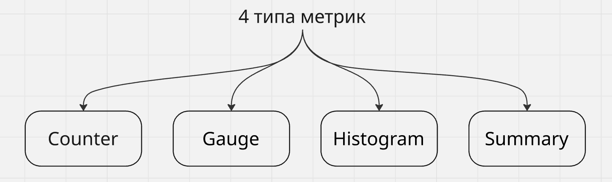

# Учимся писать свой Prometheus exporter на Go с нуля. Часть 1. Основы Prometheus и каркас нашего будущего exporter-а

# Оглавление
1. [Введение](#vvedenie)
2. [Глава 1. Основы Prometheus](#1)
3. [1.1. Теория: Prometheus и экспортеры](#1-1)
4. [1.2. Что такое exporter и когда он нужен](#1-2)
5. [1.3. Формат метрик](#1-3)
6. [1.4. Типы метрик](#1-4)
7. [1.5. Лейблы](#1-5)
8. [1.6. Naming convention](#1-6)
9. [1.7. Exporter в общей картине](#1-7)
10. [1.8. Выводы по первой главе](#1-8)
11. [Глава 2. Каркас нашего будущего exporter-а](#2)
12. [2.1. Теория: модули и пакеты языка Go](#2-1)
13. [2.2. Создаем проект](#2-2)
14. [2.3. Настраиваем базовый сервер](#2-3)
15. [2.4. Настраиваем эндпоинты /metrics и /healthz](#2-4)
16. [2.5 Теория по библиотеке client_golang](#2-5)
17. [2.6 Подключаем библиотеку client_golang](#2-6)
18. [2.7 Паттерн Custom Collector](#2-7)
19. [2.8 Теория по интерфейсу Collector](#2-8)
20. [2.9 Создаем свой интерфейс Collector](#2-9)
21. [Итоги](#3)

# Введение
<a id="vvedenie"></a>
Всем привет! Я DevOps-разработчик в одной из бигтех компаний России. Это практический курс, написанный мной в формате цикла статей, где мы шаг за шагом напишем собственный Prometheus exporter с нуля на языке Go. Но просто взять и написать код exporter-а мало, тем более в эпоху ИИ, возможно, это самая легкая часть. Моя же цель дать вам основу, как теоретическую, так и практическую, чтобы вы понимали концепцию, как и для чего пишутся exporter-ы, дать вам фундамент для разработки своих exporter-ов под любые задачи в будущем.

Я разделил данный курс на 5 основных частей, чтобы в него было легче погрузиться. Темы разбиты таким образом, чтобы накапливать теоретическую и практическую базу постепенно, поэтому для лучшего понимания рекомендую идти по-порядку от 1 к 5 части. Вот основные блоки:
1. Часть 1. Основы Prometheus и каркас нашего будущего exporter-а.
2. Часть 2. Настраиваем сбор метрик Kafka.
3. Часть 3. Делаем наш exporter production ready.
4. Часть 4. Тестирование, сборка и экплуатация.
5. Часть 5. Exporter для любую задачу.

В качестве примера реализации своего exporter-а я выбрал kafka_exporter. Он идеально подходит для учебного примера, перечислю несколько фактов за: он покрывает несколько типов источников, столкнемся с паттерном Custom Collector, легко тестировать локально и есть много популярных kafka_exporter, с которыми мы сможем сравнить наш результат. Код нашего exporter-а я буду коммитить в репозиторий [kafka_exporter_prometheus](https://github.com/galazat/kafka_exporter_prometheus). Вы сможете заглянуть в него при необходимости. 

К концу этого курса у тебя будет:
- Рабочий exporter на Go, который собирает метрики Kafka.
- Понимание того, как работает Prometheus.
- Понимание, как подготовить exporter под разные форматы запуска: systemd, docker, k8s.
- Основа знаний, для разработки собственных exporter-ов

# Глава 1. Основы Prometheus 
<a id="1"></a>
Прежде чем писать код, нужно понять что мы вообще строим и зачем. Если пропустить базовую теорию, дальше постоянно будут возникать вопросы "почему это работает именно так? почему мы выбрали то или иное решение?". Первая часть будет без кода - только общая модель того, для чего это нужно и как это все работает.

## 1.1. Теория: Prometheus и экспортеры
<a id="1-1"></a>


Prometheus - это система мониторинга и база данных временных рядов (time-series database, TSDB). Если попробовать описать работу Prometheus одним предложением, то можно написать примерно следующее:

> Prometheus периодически _ходит_ по HTTP к определенному списку сервисов, забирает у них текущие значения метрик и складывает их в свою базу с привязкой ко времени.

Ключевое здесь это то, что он _ходит сам_. Это называется **pull-модель**.

### Push vs Pull

Есть два подхода к сбору метрик:
- Push (например StatsD, Graphite) - приложение само отправляет метрики в центральный сервер, сам сервер просто принимает данные. 
- Pull (Prometheus) - центральный сервер сам периодически опрашивает приложения, а приложение просто держит открытым HTTP-эндпоинт.

Как мы выяснили, Prometheus работает по pull-модели, и для нас это важно, потому что exporter - это и есть тот HTTP-эндпоинт, который ждет, пока Prometheus к нему придет.

### Почему pull-удобен

- Prometheus сам решает, когда и как часто собирать те или иные метрики приложения (определяется интервал scrape).
- Легко понять "живо" ли приложение, если scrape не удался - то цель down. Получаем дополнительную метрику `up`.
- Относительная простота: приложение просто отдает текстовый документ по HTTP через метод GET.

Процесс одного опроса называется **scrape**. По умолчанию Prometheus делает scrape каджые 15–60 секунд, но это гибко настраивается.

## 1.2. Что такое exporter и когда он нужен
<a id="1-2"></a>

Многие системы (например, Kafka, PostgreSQL, Redis, сетевое железо и другие) **не умеют** отдавать метрики в формате Prometheus. Они либо вообще не отдают метрики по HTTP, либо отдают их в своём формате, например, JMX, SNMP, или через собственный API.

Exporter - это «переводчик-посредник» между приложением и Prometheus. Вот схема работы exporter:
Exporter делает три вещи:
1. Подключается к целевой системе ее родным способом. (Например, для Kafka подключается по протоколу Kafka через библиотеку Sarama)
2. Получает у нее сырые данные. (Например, список топиков, offset-ы, число брокеров и др.)
3. Переводит их в формат Prometheus и отдает по HTTP на энпоинт `/metrics`.  (путь `/metrics` выбрала команда Prometheus, она зафиксировала его в своей конфигурации как default, а затем он стал де-факто стандартом всей экосистемы)

Наш будущий exporter - ровно такой посредник между Kafka и Prometheus.

>**Когда появляется необходимость писать свой exporter?** 
>Когда для твоей системы нет готового, либо готовый не отдает нужные тебе метрики. Часто проще написать 200-300 строк своего кода, чем мучиться и разбираться с чужим. Навык из этого курса как раз про это.

## 1.3. Формат метрик
<a id="1-3"></a>

Приятно то, в каком формате exporter отдает метрики - это просто **текст**. Вот как к примеру выглядит ответ на GET `/metrics` для одного из существующих kafka_exporter:


Рассмотрим метрики ближе:
```text
# HELP kafka_brokers Number of Brokers in the Kafka Cluster.
# TYPE kafka_brokers gauge
kafka_brokers 3

# HELP kafka_topic_partitions Number of partitions for this Topic
# TYPE kafka_topic_partitions gauge
kafka_topic_partitions{topic="orders"} 6
kafka_topic_partitions{topic="payments"} 3
```

Разберем построчно вывод метрик. В нашей дальнейшей работе этот формат будет базой, мы будет опираться на него при написании нашего кода:

- `#HELP <имя> <текст>` - человекочитаемое описание метрик, нужно для понимания пользователям.
- `#TYPE <имя> <тип>` - тип метрики (`gauge`, `counter`, ...). Основные типы метрик мы рассмотрим позже.
- `<имя>{лейблы} <значение>` - имя самой метрики, набор лейблов в {} (их мы тоже рассмотрим ниже) и непосредственно само числовое значение метрики.

Каждая строка с данными - это одна **серия** (time series). Например, `kafka_topic_partitions{topic="orders"}` и `kafka_topic_partitions{topic="payments"}` - это **две разные серии** одной метрики, которые различаются лейблом `topic`.

> Поспешу обрадовать: руками писать весь этот текст нет необходимости. Библиотека `client_golang` сгенерирует его за нас. Но понимать, что получается на выходе, необходимо. Мы еще не раз будем `curl`-ить наш exporter по ходу его написания. 

## 1.4. Типы метрик
<a id="1-4"></a>
Prometheus знает четыре основных типа метрик:



### Counter (счётчик) 
Монотонно **растущее** значение, которое только увеличивается (или сбрасывается в
0 при рестарте). Примеры: число обработанных запросов, число ошибок, число
отправленных байт.

```text
http_requests_total{method="GET"} 1027
```

Само абсолютное значение counter-а не всегда бывает полезным. Смысл появляется, когда мы берём от него **скорость роста** функцией `rate()`:
- `rate(http_requests_total[5m])` — количество запросов в секунду за последние 5 минут.

> Naming convention: обрати внимание, что имя counter-а по хорошему должно заканчиваться на `_total`.

### Gauge (измеритель)
Метрика, значение которого может **расти и падать** в любую сторону. Это "мгновенный
снимок" системы. Примеры таких метрик: температура, использование памяти, число активных соединений, число брокеров и другие.

```text
kafka_topic_partitions{topic="orders"} 6
```

> Так как мы пишем свой exporter для kafka, то для нас важно: почти все метрики Kafka — это gauge. Число брокеров, партиций, offset, lag - всё это текущее состояние системы, которое мы измеряем в момент scrape. Поэтому в нашем exporter будут в основном метрики типа gauge.

### Histogram (гистограмма)
Нужен когда важно **распределение значений** - например, латентность запросов. Histogram раскладывает наблюдения по "корзинам" (buckets): сколько запросов уложилось в 0.1с, 0.5с, 1с и т.д.

```text
http_request_duration_seconds_bucket{le="0.1"} 243
http_request_duration_seconds_bucket{le="0.5"} 891
http_request_duration_seconds_bucket{le="1.0"} 1020
http_request_duration_seconds_bucket{le="+Inf"} 1024
http_request_duration_seconds_sum 476.3
http_request_duration_seconds_count 1024
```

`le` означает "less or equal". Bucket-ы **кумулятивные** — каждый включает все предыдущие. `+Inf` всегда равен общему числу наблюдений.

Из histogram-а можно считать перцентили через PromQL:
```text
histogram_quantile(0.99, rate(http_request_duration_seconds_bucket[5m]))
```

— p99 латентности за последние 5 минут.

> **Naming convention:** суффикс с единицей измерения (`_seconds`, `_bytes` и т.д.). Автоматически добавляются `_bucket`, `_sum`, `_count`.

### Summary (сводка)
Тоже считает перцентили, но **вычисляет их на стороне клиента** (в самом приложении), а не на стороне Prometheus.

```text
rpc_duration_seconds{quantile="0.5"} 0.012
rpc_duration_seconds{quantile="0.9"} 0.034
rpc_duration_seconds{quantile="0.99"} 0.127
rpc_duration_seconds_sum 8953.1
rpc_duration_seconds_count 27143
```

## 1.5. Лейблы
<a id="1-5"></a>
Лейблы - это пары `ключ="значение"`, которые «нарезают» одну метрику на множество
серий:

```text
kafka_consumergroup_lag{consumergroup="billing", topic="orders", partition="0"} 42
kafka_consumergroup_lag{consumergroup="billing", topic="orders", partition="1"} 17
```

Это **одна метрика** `kafka_consumergroup_lag`, но две серии - для партиций 0 и 1. В Prometheus потом можно делать запросы вроде:
- `sum(kafka_consumergroup_lag) by (consumergroup)` — суммарный lag по каждой
  группе.
- `kafka_consumergroup_lag{topic="orders"}` — lag только для топика orders.

### Правило кардинальности
Каждая уникальная комбинация лейблов -> отдельная серия -> отдельная запись в
памяти Prometheus. Если лейбл может принимать много значений (user_id, email,
timestamp, request_id), будет порождаться миллионы серий, что потенциально может положить Prometheus. Это называется **cardinality explosion**.

> **Нужно запомнить:** лейблы подходят для значений с *ограниченным, предсказуемым* набором (например, топик, партиция, имя группы - их максимум тысячи). Не нужно использовать в качестве лейбла то, что никак неограниченно (например, ID сообщения, offset как значение лейбла).

Мы будем держать это в голове: `partition` как лейбл - ок (их десятки), а вот
значение offset - это значение метрики, а не лейбл.

## 1.6. Naming convention
<a id="1-6"></a>

У Prometheus строгие, но простые правила именования. Соблюдать их важно, чтобы 
ваши метрики не выбивались из общей экосистемы. Давайте рассмотрим основные правила:
1. Формат: `<namespace>_<subsystem>_<name>_<unit>`.
   - `namespace` — префикс под систему, например, `kafka`.
   - `subsystem` — подсистема, например `broker`.
   - `unit` — единица измерения в базовых единицах: секунды (не мс), байты
     (не килобайты).
   - Получившееся название: `kafka_topic_partition_current_offset`.
1. snake_case, только `[a-zA-Z0-9_]`. Никаких дефисов и точек.
2. Counter заканчивается на `_total`.
3. Единицы измерений в качестве суффикса: `_seconds`, `_bytes`, `_ratio`.
4. Метрика должна иметь один смысл.

## 1.7. Exporter в общей картине
<a id="1-7"></a>
Рассмотрим общую схему доставки метрик на примере kafka:


В нашем курсе мы будем реализовывать блок с Exporter.

>**Основной принципы exporter**:
>Exporter не хранит метрики во времени, историю хранит сам Prometheus. Exporter отдаёт текущие значения метрик, в момент scrape Prometheus-а. То есть exporter собирает свежие данные на каждый новый запрос к `/metrics`.  

## 1.8. Выводы по первой главе
<a id="1-8"></a>

- Prometheus работает по pull-модели: сам ходит к exporter'у на `/metrics`.
- Exporter - это переводчик из родного протокола системы в формат Prometheus.
- Формат метрик - простой текст с `# HELP`, `# TYPE` и строками данных.
- Типы: counter (только растёт, `rate()`), gauge (мгновенное значение).
  В Kafka почти всё - gauge.
- Лейблы нарезают метрику на серии, нужно учитывать кардинальностью.
- Имя метрики: `namespace_subsystem_name_unit`, snake_case, базовые единицы.
- Exporter отдаёт снимок состояния на каждый scrape, историю хранит
  Prometheus.


# Глава 2. Каркас нашего будущего exporter-а
<a id="2"></a>
Мы уже выяснили, что exporter под капотом это обычный HTTP-сервер, который отдает текстовые данные по `/metrics`. Начнем строить каркас нашего будущего exporter, напишем HTTP-сервер.

## 2.1. Теория: модули и пакеты языка Go
<a id="2-1"></a>
Прежде чем мы создадим свой проект, важно понять, что каждый проект в языке Go называется модулем. В корне проекта находится файл `go.mod`, который описывает имя модуля и его зависимости. Имя модуля - это путь импорта (обычно это адрес репозитория, например, `github.com/имя/kafka-exporter`). 

### Пакет `net/http`
Пакет `net/http` - это стандартная библиотека языка Go, с помощью которого мы поднимем свой HTTP-сервер, без установки каких-либо сторонних пакетов. В контексте данного пакета нам важны следующие параметры:
- **Handler** - функция, обрабатывающая запрос. Сигнатура: `func(w http.ResponseWriter, r *http.Request)`, `w` для записи ответа, `r` для чтения запроса. 
- **ServeMux** - маршрутизатор. Он сопоставляет URL-путь с конкретным handler'ом: `mux.HandleFunc("/path", handler)`.
- **Server** - сам сервер. Отвечает за то, на каком адресе слушать и какой mux использовать. Функция `server.ListenAndServe()` запускает его.

> Мы будет использовать свой `ServeMux`, а не глобальный `http.HandleFunc`, потому что глобальный регистрирует handler'ы в общем `DefaultServeMux`, в который могут «втихаря» прописаться сторонние пакеты (это известная проблема, кому интересно, рекомендую прочитать отдельно про это). Свой mux будет изолированным.

## 2.2. Создаем проект
<a id="2-2"></a>
Наконец мы дошли до момента, когда нам нужно будет открыть терминал и создать наш проект. Я полагаю, чтобы вы уже знакомы с основами языка Go, поэтому не буду показывать этапы установки и настройки окружения для работы. Весь свой код я буду хранить в репозитории [kafka_exporter_prometheus](https://github.com/galazat/kafka_exporter_prometheus), чтобы код накапливался в одном месте. 

Начнем работу:

```go
mkdir my-kafka-exporter && cd my-kafka-exporter
go mod init github.com/<yourname>/my-kafka-exporter
```

Если не хотите публиковать свое решение, то рекомендую использовать локальный module path в названии модуля:

```go
mkdir my-kafka-exporter && cd my-kafka-exporter
go mod init study/my-kafka-exporter
```

## 2.3. Настраиваем базовый сервер
<a id="2-3"></a>
Создадим в корне проекта файл `main.go`:

```go
package main

import (
	"log"
	"net/http"
)

func main() {
	// Создаем свой ServeMux - явный и изолированный, а не используем глобальный. Пустой маршрутизатор
	mux := http.NewServeMux()

	// Регистрируем handler на корневой путь "/"
	mux.HandleFunc("/", func(w http.ResponseWriter, r *http.Request) {
		w.Write([]byte("kafka_exporter is active\n"))
	})

	// Описываем сервер, слушаем на порту 9308, используем наш mux.
	server := &http.Server{
		Addr:    ":9308",
		Handler: mux,
	}

	log.Println("Listening on :9308")

	// ListenAndServe блокирует выполнение, пока сервер работает. При возврате ошибки (например, порт занят) - логируем.
	log.Fatal(server.ListenAndServe())
}
```

Запускаем код:
```bash
go run .
# для остановки сервера Ctrl+C
```

В соседнем терминале проверяем работу:
```bash
curl localhost:9308 # можно также curl http://localhost:9308/
```

Разберем, что мы сделали:
- `main` - точка входа в программу.
- мы выбрали `:9308` порт, потому что у Prometheus есть [реестр портов exporter'ов](https://github.com/prometheus/prometheus/wiki/Default-port-allocations) и для kafka_exporter закреплен этот порт.
- `log.Fatal(server.ListenAndServe())` - чтобы сервис вернул ошибку при падении.

## 2.4. Настраиваем эндпоинты /metrics и /healthz
<a id="2-4"></a>
Реальный exporter должен иметь минимум 3 эндпоинта. Добавим их в наш код и поставим заглушку на время. Также вынесем настройку сервера в отдельную функцию `setup`, чтобы в дальнейшем было удобно тестировать и добавлять флаги:

```go
package main

import (
	"log"
	"net/http"
)

const (
	listenAddr = ":9308"
	metricsPath = "/metrics"
)

func main() {
	setup(listenAddr, metricsPath)
}

func setup(listenAddr, metricsPath string) {
	// Создаем свой ServeMux - явный и изолированный, а не используем глобальный. Пустой маршрутизатор
	mux := http.NewServeMux()

	// Регистрируем handler на корневой путь "/"
	mux.HandleFunc("/", func(w http.ResponseWriter, r *http.Request) {
		w.Write([]byte("kafka_exporter is active\n"))
	})

	// эндпоинт /healthz - это проба, сервис живой. Например, k8s проверяет - жив ли процесс. Пока просто отвечаем "ok"
	mux.HandleFunc("/healthz", func(w http.ResponseWriter, r *http.Request) {
		w.Write([]byte("ok"))
	})

	// эндпоинт /metrics - здесь будут метрики. Пока заглушка в формате Prometheus.
	mux.HandleFunc(metricsPath, func(w http.ResponseWriter, r *http.Request) {
		w.Header().Set("Content-Type", "text/plain; version=0.0.4")
		w.Write([]byte("# HELP my_exporter_up Is the exporter running.\n"))
		w.Write([]byte("# TYPE my_exporter_up gauge\n"))
		w.Write([]byte("my_exporter_up 1\n"))
	})


	// Описываем сервер, слушаем на порту 9308, используем наш mux.
	server := &http.Server{
		Addr:    listenAddr,
		Handler: mux,
	}

	log.Println("Listening on :9308")

	// ListenAndServe блокирует выполнение, пока сервер работает. При возврате ошибки (например, порт занят) - логируем.
	log.Fatal(server.ListenAndServe())
}
```

Запустим и проверим работу:
```bash
go run .

curl http://localhost:9308/healthz
# ok

curl http://localhost:9308/metrics
# # HELP my_exporter_up Is the exporter running.
# # TYPE my_exporter_up gauge
# my_exporter_up 1
```

Разберем, что мы сделали:
- `/healthz` - стандартный эндпоинт для Kubernetes health-проб. На него можно повесить `livenessProbe` и `readinessProbe`. Пока оставим ее так, дальше мы поправим его.
- `Content-Type: text/plain; version=0.0.4` - официальный media-type формата экспозиции Prometheus версии 0.0.4. Prometheus по нему понимает, как парсить ответ. Когда мы подключим `client_golang`, заголовок будет выставляться автоматически.
- `/metrics ` - пока отдает текст, написанный вручную. Далее мы будем использовать библиотеку для этого, чтобы не мучаться руками.
- разделили: `main` - как запустить, `setup` - что делать.

## 2.5 Теория по библиотеке client_golang
<a id="2-5"></a>
В прошлом примере мы отдавали метрики на `/metrics`, написанные вручную. Давайте автоматизируем это и подключим официальную библиотеку Prometheus для Go - `client_golang`.

`client_golang` берет на себя всю рутину: форматирование, экранирование лейблов, заголовки, а также из коробки отдает системные метрики самого процесса.

Библиотека `github.com/prometheus/client_golang` состоит из двух частей, которые нам понадобятся:
- `prometheus` - ядро: содержит типы метрик (`Gauge`, `Counter`, ...), registry и интерфейсы.
- `promhttp` - готовый HTTP-handler, который превращает содержимое реестра в текст необходимого нам формата и отдаёт его на `/metrics`.


Для нас важно понять как работает registry. **Registry** - это коллекция всех метрик приложения. Логика следующая:
1. *регистрируешь* метрику в registry (`prometheus.MustRegister(...)`).
2. в момент scrape `promhttp` обходит registry, у каждой метрики спрашивает текущее значение и собирает итоговый текстовый документ.

Есть *глобальный registry по умолчанию* (`prometheus.DefaultRegisterer`). При вызыве `prometheus.MustRegister`, метрика попадает именно туда, а `promhttp.Handler()` по умолчанию читает именно его. Для начала этого достаточно, далее мы разберем как создать свой registry.

Рассмотрим способы отдачи метрик. Есть два способа:
- прямые метрики - создаётся объект метрики и в коде у него вызывается `.Set()`, `.Inc()`.  Значение хранится в библиотеке. Подходит, когда приложение само порождает метрику (например, веб-сервис считает свои запросы).
- Custom Collector - необходимо реализовать интерфейс, метрики собираются «на лету» в момент scrape. Подходит для exporter-ов.

Мы рассмотрим оба варианта, но в нашем решении будем использовать Custom Collector.


## 2.6 Подключаем библиотеку client_golang
<a id="2-6"></a>
Перейдем к установке библиотеки, следующая команды скачает зависимость и пропишет её в `go.mod`/`go.sum.`:

```bash
go get github.com/prometheus/client_golang/prometheus
# или можно прописать импорт к коде и вызвать `go mod tidy`
```

Теперь перейдем к коду, нас ждет много обновлений и дополнений:
1. в коде импортируем библиотеку client_golang/prometheus
2. вместо ручного текста по метрикам на /metrics, мы повесим promhttp.Handler(). Обратите внимание: в этот раз мы используем `mux.Handle` (а не HandleFunc), потому что `promhttp.Handler()` возвращает готовый объект http.Handler, а не функцию.
3. добавим собственную метрику, в качестве примера возьмём метрику типа Gauge, которая может расти и падать.

```go
package main

import (
	....

	"github.com/prometheus/client_golang/prometheus"
	"github.com/prometheus/client_golang/prometheus/promhttp"
)

const (...
)

// объявляем метрику, NewGauge возвращает объект метрики, у которого есть .Set/.Inc/.Dec.
var exporterUp = prometheus.NewGauge(prometheus.GaugeOpts{
	Namespace: "kafka",         // префикс → kafka_exporter_up
	Subsystem: "exporter",
	Name:      "up",
	Help:      "1 if the exporter is running.",
})

func main() {
	// регистрируем метрику в registry по умолчанию. MustRegister паникует, если метрику зарегистрировали дважды.
	prometheus.MustRegister(exporterUp)

	// выставляем значение метрики. Это прямая метрика - значение хранится библиотеке.
	exporterUp.Set(1)

	setup(listenAddr, metricsPath)
}

func setup(listenAddr, metricsPath string) {
	mux := http.NewServeMux()
	mux.HandleFunc("/", func(w http.ResponseWriter, r *http.Request) {
		w.Write([]byte("kafka_exporter is active\n"))
	})
	mux.HandleFunc("/healthz", func(w http.ResponseWriter, r *http.Request) {
		w.Write([]byte("ok"))
	})

	// эндпоинт /metrics теперь обслуживает promhttp. Он сам читает реестр по умолчанию и форматирует ответ.
	mux.Handle(metricsPath, promhttp.Handler())

	server := &http.Server{Addr: listenAddr, Handler: mux,}
	log.Println("Listening on :9308")
	log.Fatal(server.ListenAndServe())
}
```

Запустим и посмотрим, какие метрики отдаются:
```bash
go run .
curl http://localhost:9308/metrics # все метрики
...
# # HELP go_goroutines Number of goroutines that currently exist.
# # TYPE go_goroutines gauge
# go_goroutines 7
# # HELP go_memstats_alloc_bytes Number of bytes allocated and still in use.
# #TYPE go_memstats_alloc_bytes gauge
# go_memstats_alloc_bytes 1.234e+06
...

curl -s http://localhost:9308/metrics | grep kafka_exporter_up # только метрику, которую мы задали
# # HELP kafka_exporter_up 1 if the exporter is running.
# # TYPE kafka_exporter_up gauge
# kafka_exporter_up 1
```

При обращении к `/metrics` мы увидим большое множество метрик, которых мы не создавали. Это дефолтные коллекторы Go-клиента:
- go_* - метрики Go-рантайма: число goroutine, состояние GC, память.
- process_* - метрики ОС-процесса: CPU, резидентная память, открытые файловые дескрипторы. 

Они регистрируются в registry по умолчанию автоматически. Получается мы бесплатно получаем мониторинг здоровья самого exporter-а (не течёт ли память, сколько goroutine).

Теперь перейдем к нашей метрике, разберем конструкции, которые мы использовали в коде:
- `GaugeOpts{Namespace, Subsystem, Name}` - библиотека сама склеивает имя метрики через `_`: kafka + exporter + up = kafka_exporter_up. Еще помните про naming convention?
- `Help` - текст для # HELP, заполняй осмысленно.
- `MustRegister` - добавляет метрику в registry. Префикс Must означает «паника при ошибке» (двойная регистрация, конфликт имён). Для метрик, объявленных на старте, это ок - лучше упасть сразу, чем молча потерять метрику.
- `exporterUp.Set(1)` - задаём значение. Значение живёт внутри объекта Gauge.

**Метрики с лейблами - GaugeVec**
В действительности, часто нужна не одна серия, а семейство серий с разными лейблами (вспомним kafka_topic_partitions{topic="..."}). Для этого есть `*Vec` типы (например `GaugeVec`).

```go
...
var topicPartitions = prometheus.NewGaugeVec(
	prometheus.GaugeOpts{
		Namespace: "kafka",
		Subsystem: "topic",
		Name:      "partitions",
		Help:      "Number of partitions for this topic.",
	},
	[]string{"topic"}, // имена лейблов
)

func main() {
	prometheus.MustRegister(topicPartitions)

	// .WithLabelValues(...) возвращает конкретную серию по значениям лейблов.
	topicPartitions.WithLabelValues("orders").Set(6)
	topicPartitions.WithLabelValues("payments").Set(3)

	setup(":9308", "/metrics")
}
...
```

Результат:
```bash
kafka_topic_partitions{topic="orders"} 6
kafka_topic_partitions{topic="payments"} 3
```

> Кажется, что GaugeVec - это и есть то, что нам нужно для Kafka? Не совсем, у него есть подвох для exporter-ов, который мы разберём далее (кратко, проблема «устаревших» серий, когда топик удалили, а серия осталась). Поэтому для Kafka мы выберем другой инструмент - Collector с ConstMetric. А GaugeVec отлично подходит для метрик, которые порождает само приложение.

Откуда брать имена пакетов и функций?
Чтобы не запоминать всё наизусть:
- Документация: https://pkg.go.dev/github.com/prometheus/client_golang/prometheus

## 2.7 Паттерн Custom Collector
<a id="2-7"></a>
Сейчас мы разберем паттерн, на котором держится почти любой exporter, в том числе и наш kafka_exporter. Если сможем понять паттерн - дальше код kafka_exporter будет читаться легко.

**Зачем нужен Collector, если есть Gauge?**
Ранее мы выставляли значение метрики через `exporterUp.Set(1)`, само значение метрики при этом хранится внутри объекта. Для нашего exporter это создает следующие **проблемы**:
- значения на `/metrics` могут быть устаревшими. Значение метрики может не успеть обновиться до момента scrape. Для коректной работы нужно отдельно настраивать фоновый таймер, синхронизацию - это дополнительная сложность.
- устаревшие серии. При использовании метрики `GaugeVec`, например, `topicPartitions.WithLabelValues("orders")`, в момент удалении топика `orders` из Kafka, сама серия топика сохраняется в `GaugeVec` до явного `DeleteLabelValues`. Поэтому, если мы не удалим серию вручную, Prometheus будет считать, что топик все еще есть, так как получает соответствующие метрики.

**Решение: использовать Custom Collector + ConstMetric**
На каждый новый scrape должно происходить следующее:
- необходимо сходить в источник, в нашем случае в Kafka.
- далее нужно создать метрики "на лету" из свежих данных, отдать их и забыть про них (это и есть ConstMetric - одноразовая метрика, созданная под конкретный scrape),

Теперь, при удалении топика, следующий scrape просто не получит соответствующие метрики из Kafka, серия сама исчезает. Никакого ручного управления состоянием. Это и есть способ, которым работает kafka_exporter.

## 2.8 Теория по интерфейсу Collector
<a id="2-8"></a>
Мы реализуем свой Collector посредством реализации интерфейса `prometheus.Collector`. Интерфейс состоит всего из двух методов:

```go
type Collector interface {
	// Describe отправляет в канал описания всех метрик, которые коллектор когда-либо может вернуть.
	Describe(chan<- *prometheus.Desc)

	// Collect вызывается на каждый scrape. Здесь мы собираем актуальные данные и отправляем метрики в канал.
	Collect(chan<- prometheus.Metric)
}
```

`*prometheus.Desc` - описание метрики: её полное имя, help-текст и список имён лейблов (без значений). Создаётся один раз, он неизменяем и переиспользуется между scrape. Его необходимо подготовить заранее.
```go
desc := prometheus.NewDesc(
	"kafka_brokers",                       // полное имя
	"Number of brokers in the cluster.",   // help
	nil,                                   // имена переменных лейблов
	nil,                                   // постоянные лейблы (constLabels)
)
```

`prometheus.Metric` - сама метрика со значением создаётся в Collect через `MustNewConstMetric`:

```go
metric := prometheus.MustNewConstMetric(
	desc,                      // тот самый Desc
	prometheus.GaugeValue,     // тип значения
	float64(3),                // значение
	// дальше идут значения лейблов, по порядку имён из Desc
)
```

В Desc мы задаем имена лейблов ([]string{"topic","partition"}). В MustNewConstMetric передаем их значения в том же порядке ("orders", "0"). Их количество должно совпадать, иначе будет паника, это необходимо держать в голове.

Теперь рассмотрим сами методы Describe и Collect и реализации нашего Collector:
- `Describe`: вызывается при регистрации коллектора. Его задача - сообщить реестру заранее, какие метрики существуют (для валидации, обнаружения конфликтов имён). Просто отправляем все наши Desc в канал:
```go
func (c *MyCollector) Describe(ch chan<- *prometheus.Desc) {
	ch <- c.brokersDesc
}
```
- `Collect`: вызывается на каждый scrape. Здесь заложена вся логика: сходить за данными, создать ConstMetric, отправить их в канал:
```go
func (c *MyCollector) Collect(ch chan<- prometheus.Metric) {
	value := goAndFetchFromKafka()        // сходили за свежими данными
	ch <- prometheus.MustNewConstMetric(  // создали метрику на лету
		c.brokersDesc, prometheus.GaugeValue, float64(value),
	)
}
```

`promhttp` сам вычитывает всё из канала и сформирует текст. В нашем случае каналы - это способ стримить метрики: коллектор может слать их по мере готовности, не собирая в большой слайс.

## 2.9 Создаем свой интерфейс Collector
<a id="2-9"></a>
Сейчас мы добавим в наш код свой Collector, но пока он будет возвращать тестовые данные. В Части 2 мы подключим настоящую Kafka и будем собирать реальные метрики. Чтобы сделать наш код читаемым, мы вынесем реализацию Collector в отдельный файл `exporter.go` и положим его рядом с `main.go`:
```go
package main

import (
	"github.com/prometheus/client_golang/prometheus"
)

const namespace = "kafka" // для имени метрик

// Это наши описания метрик - Descriptors. Мы их готовим заранее и переиспользуем
var (
	clusterBrokers = prometheus.NewDesc(
		prometheus.BuildFQName(namespace, "", "brokers"),
		"Number of brokers in the Kafka cluster.",
		nil, nil, // нет переменных лейблов, нет постоянных
	)
	topicPartitions = prometheus.NewDesc(
		prometheus.BuildFQName(namespace, "topic", "partitions"),
		"Number of partitions for this topic.",
		[]string{"topic"}, // один переменный лейбл: topic
		nil,
	)
)

// Exporter реализует интерфейс prometheus.Collector
type Exporter struct {
	// Сюда позже добавим клиент Kafka. Пока оставим пустым
}

func NewExporter() *Exporter {
	return &Exporter{}
}

// Describe: перечисляем все метрики, которые умеем отдавать
func (e *Exporter) Describe(ch chan<- *prometheus.Desc) {
	ch <- clusterBrokers
	ch <- topicPartitions
}

// Collect: вызывается на каждый scrape. Происходит сбор данных
func (e *Exporter) Collect(ch chan<- prometheus.Metric) {
	// Пока тестовые данные. В Части 2 заменим на реальные из Kafka

	// Метрика без лейблов: число брокеров = 3
	ch <- prometheus.MustNewConstMetric(
		clusterBrokers, prometheus.GaugeValue, float64(3),
	)

	// Метрики с лейблом topic. Эмулируем два топика
	fakeTopics := map[string]int{"orders": 6, "payments": 3}
	for topic, partitions := range fakeTopics {
		ch <- prometheus.MustNewConstMetric(
			topicPartitions,
			prometheus.GaugeValue,
			float64(partitions),
			topic,
		)
	}
}
```

Теперь подключим созданный Collector в `main.go`:
```go
...

func main() {
	// Регистрируем наш Collector. Теперь на каждый scrape Prometheus будет вызызать e.Collect()
	exporter := NewExporter()
	prometheus.MustRegister(exporter)

	setup(":9308", "/metrics")
}

func setup(listenAddr, metricsPath string) {
	mux := http.NewServeMux()
	mux.HandleFunc("/healthz", func(w http.ResponseWriter, r *http.Request) {
		w.Write([]byte("ok"))
	})
	mux.Handle(metricsPath, promhttp.Handler())
	server := &http.Server{
		Addr:    listenAddr,
		Handler: mux,
	}
	log.Println("Listening on :9308")
	log.Fatal(server.ListenAndServe())
}
```

Запускаем и проверяем, что нужные нам метрики отдаются:
```bash
go run .
curl -s http://localhost:9308/metrics | grep kafka_
```
```text
# HELP kafka_brokers Number of brokers in the Kafka cluster.
# TYPE kafka_brokers gauge
kafka_brokers 3
# HELP kafka_topic_partitions Number of partitions for this topic.
# TYPE kafka_topic_partitions gauge
kafka_topic_partitions{topic="orders"} 6
kafka_topic_partitions{topic="payments"} 3
```

Можно себя поздравить! Мы подготовили архитектуру настоящего exporter. Дальше мы заменим тестовые данные на реальные из Kafka, а каркас Describe/Collect останется.

# Итоги 
<a id="3"></a>
Это конец Части 1, можно поздравить себя, теперь у нас готов рабочий каркас для нашего будущего exporter. Далее нам предстоит подключиться к настроящей Kafka и настроить сбор реальных метрик кластера. Опишем тезисно, что мы вынесли из всего этого материала:

- Prometheus работает по pull-модели: сам ходит к exporter на /metrics;
- exporter - это переводчик из родного протокола системы в формат Prometheus;
- формат метрик - простой текст с # HELP, # TYPE и строками данных;
- основные типы метрик: counter (только растёт, rate()), gauge (мгновенное значение);
- лейблы нарезают метрику на серии;
- имена метрик: namespace_subsystem_name_unit, snake_case, базовые единицы;
- exporter отдаёт снимок состояния на каждый scrape, историю хранит Prometheus;
- мы подняли HTTP-сервер на net/http с собственным ServeMux. Порт 9308 закреплён за kafka_exporter в реестре Prometheus;
- подключили client_golang: prometheus (ядро) + promhttp (handler). Получили дефолтные метрики go_* и process_*;
- паттерн Custom Collector + ConstMetric - это стандарт для exporter: свежие данные на каждый scrape, нет проблемы устаревших серий;
- cобрали полноценный каркас exporter на тестовых данных.

